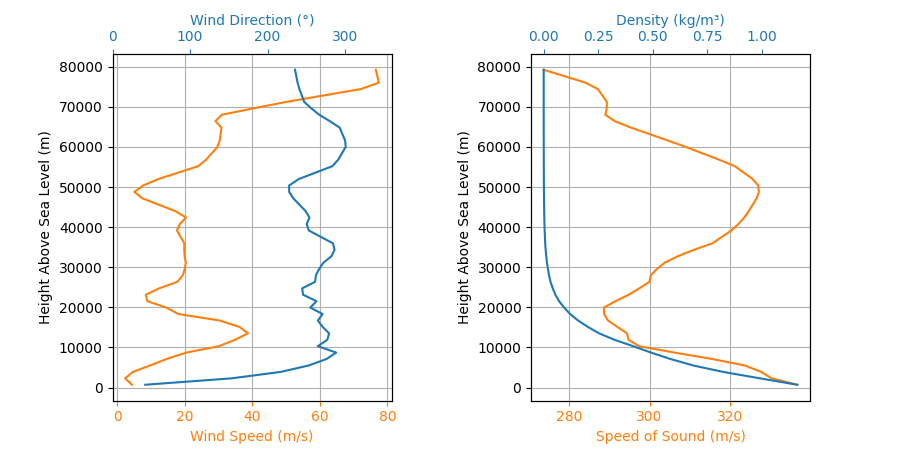

# Rocketpy projects

I thought this was a very neat library, and that it might be worth sketching out some ideas for it. Rocket....Pyience?


## Test Flight Reference Information

Test flight code reference output for the whole launch with Forecast atmospheric data.


## Output
I've included some images from the test code to give a sample of what they look like. There was 13 outputted total.


### Environment forecast 


### Flight Trajectory


```
Launch Site Details

Launch Rail Length: 5.2  m
Launch Date: 2023-03-24 12:00:00 UTC
Launch Site Latitude: 32.99025°
Launch Site Longitude: 106.97500°
Reference Datum: SIRGAS2000
Launch Site UTM coordinates: 684531.36 E    3651938.65 N
Launch Site UTM zone: 48S
Launch Site Surface Elevation: 688.5 m


Atmospheric Model Details

Atmospheric Model Type: Forecast
Forecast Maximum Height: 79.264 km
Forecast Time Period: From  2023-03-22 06:00:00  to  2023-04-07 06:00:00  UTC
Forecast Hour Interval: 3  hrs
Forecast Latitude Range: From  -90.0 ° To  90.0 °
Forecast Longitude Range: From  0.0 ° To  359.75 °


Surface Atmospheric Conditions

Surface Wind Speed: 4.32 m/s
Surface Wind Direction: 42.19°
Surface Wind Heading: 222.19°
Surface Pressure: 940.35 hPa
Surface Temperature: 281.89 K
Surface Air Density: 1.162 kg/m³
Surface Speed of Sound: 336.57 m/s


Atmospheric Model Plots

Motor Details
Total Burning Time: 3.9 s
Total Propellant Mass: 2.956 kg
Propellant Exhaust Velocity: 2038.745 m/s
Average Thrust: 1545.218 N
Maximum Thrust: 2200.0 N at 0.15 s after ignition.
Total Impulse: 6026.350 Ns

Plots
Initial Conditions

Position - x: 0.00 m | y: 0.00 m | z: 688.46 m
Velocity - Vx: 0.00 m/s | Vy: 0.00 m/s | Vz: 0.00 m/s
Attitude - e0: 0.999 | e1: -0.044 | e2: -0.000 | e3: 0.000
Euler Angles - Spin φ : 0.00° | Nutation θ: -5.00° | Precession ψ: 0.00°
Angular Velocity - ω1: 0.00 rad/s | ω2: 0.00 rad/s| ω3: 0.00 rad/s


Launch Rail Orientation

Launch Rail Inclination: 85.00°
Launch Rail Heading: 0.00°


Surface Wind Conditions

Frontal Surface Wind Speed: -3.16 m/s
Lateral Surface Wind Speed: 2.94 m/s


 Rail Departure State

Rail Departure Time: 0.364 s
Rail Departure Velocity: 25.824 m/s
Rail Departure Static Margin: 2.134 c
Rail Departure Angle of Attack: 9.468°
Rail Departure Thrust-Weight Ratio: 10.146
Rail Departure Reynolds Number: 3.361e+00


BurnOut State

BurnOut time: 3.900 s
Altitude at burnOut: 650.771 m (AGL)
Rocket velocity at burnOut: 277.441 m/s
Freestream velocity at burnOut: 278.274 m/s
Mach Number at burnOut: 0.835
Kinetic energy at burnOut: 6.251e+05 J


Apogee

Apogee Altitude: 3848.206 m (ASL) | 3159.744 m (AGL)
Apogee Time: 25.205 s
Apogee Freestream Speed: 26.819 m/s


Events

Drogue Ejection Triggered at: 25.210 s
Drogue Parachute Inflated at: 26.710 s
Drogue Parachute Inflated with Freestream Speed of: 30.447 m/s
Drogue Parachute Inflated at Height of: 3148.775 m (AGL)
Main Ejection Triggered at: 115.238 s
Main Parachute Inflated at: 116.738 s
Main Parachute Inflated with Freestream Speed of: 17.839 m/s
Main Parachute Inflated at Height of: 1484.617 m (AGL)


Impact

X Impact: -558.803 m
Y Impact: 192.741 m
Time of Impact: 389.807 s
Velocity at Impact: -5.234 m/s


Maximum Values

Maximum Speed: 284.256 m/s at 3.36 s
Maximum Mach Number: 0.854 Mach at 3.38 s
Maximum Reynolds Number: 3.622e+01 at 3.36 s
Maximum Dynamic Pressure: 4.513e+04 Pa at 3.34 s
Maximum Acceleration: 105.206 m/s² at 0.15 s
Maximum Gs: 10.728 g at 0.15 s
Maximum Upper Rail Button Normal Force: 0.364 N
Maximum Upper Rail Button Shear Force: 0.364 N
Maximum Lower Rail Button Normal Force: 0.364 N
Maximum Lower Rail Button Shear Force: 0.364 N


Numerical Integration Information

Maximum Allowed Flight Time: 600.000000 s
Maximum Allowed Time Step: inf s
Minimum Allowed Time Step: 0.000000e+00 s
Relative Error Tolerance:  1e-06
Absolute Error Tolerance:  [0.001, 0.001, 0.001, 0.001, 0.001, 0.001, 1e-06, 1e-06, 1e-06, 1e-06, 0.001, 0.001, 0.001]
Allow Event Overshoot:  True
Terminate Simulation on Apogee:  False
Number of Time Steps Used:  804
Number of Derivative Functions Evaluation:  2597
Average Function Evaluations per Time Step: 3.230100


Trajectory 3d Plot


Trajectory Kinematic Plots


Angular Position Plots


Path, Attitude and Lateral Attitude Angle plots


Trajectory Angular Velocity and Acceleration Plots


Trajectory Force Plots


Trajectory Energy Plots


Trajectory Fluid Mechanics Plots


Trajectory Stability and Control Plots

```

